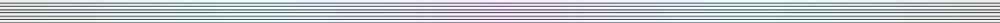
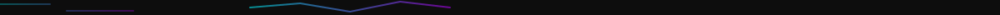

<!-- ========================================================================================== -->
<!-- 🔮 GALACTIC CYBERPUNK PROFILE : HACKU777 — README V2 (FINAL MASTERPIECE) -->
<!-- Mode: FULL CYBERPUNK IMMERSION | Identity: Codename Only | Dividers: Hybrid -->
<!-- ========================================================================================== -->

<div align="center">

<!-- HOLOGRAM BADGE -->


<br><br>

<!-- BOOT SEQUENCE -->


</div>

<div align="center">

```
/boot/HACKU777.sys
> Initializing neural matrices...
> Decrypting identity kernel...
> Loading cyber modules............. [ OK ]
> Establishing encrypted uplink..... [ OK ]
> SYSTEM STATUS: ONLINE
```

</div>

---

<!-- HYBRID DIVIDER (A + B + C + D) -->


---

<div align="center">

```
┌───────────────────────────────────────────────┐
│  IDENTITY REVEAL — LEVEL 7 CLEARANCE GRANTED   │
└───────────────────────────────────────────────┘
```

```
CODENAME: HACKU777
CLASS: Offensive Cyber Operative
VECTOR: Packet Manipulation / Network Exploitation
SIGNATURE: Ghost Layer 7
STATUS: ACTIVE
```

</div>

<br>

<!-- =============================================== -->
<!-- TERMINAL INTRO -->
<!-- =============================================== -->

<div align="center">

```
┌──( hacku777@cyberpunk )-[ ~/identity ]
│
├─▶ whoami
│     → HACKU777
│
├─▶ mission --active
│     → Cybersecurity Research
│     → Network Exploitation & NS-3 Attack Simulation
│     → Packet Engineering & Analysis
│     → OSINT / Recon Automation
│     → Ethical Offensive Security
│
├─▶ systems --load
│     → [████████████████████] 100% COMPLETE
│     → STATUS: ARMED & OPERATIONAL
│
└─▶ echo "BREACH THE IMPOSSIBLE. SECURE THE FUTURE."
```

</div>

---


---

# 🛰️ **OPERATIVE INTEL // THREAT PROFILE**

<table>
<tr>
<td width="50%" valign="top">

### 🧬 **IDENTITY MATRIX**

```python
class OperativeMatrix:
    
    def __init__(self):
        self.codename   = "HACKU777"
        self.clearance  = "LVL_7"
        self.status     = "ACTIVE"
    
    @property
    def arsenal(self):
        return [
            "Network Penetration",
            "Packet Crafting / NS-3",
            "Protocol Exploitation",
            "OSINT Automation",
            "Cryptographic Systems"
        ]
    
    @property
    def threat_level(self):
        return "██████████  CRITICAL"

# Deploy identity
HACKU777 = OperativeMatrix()
```

</td>
<td width="50%" valign="top">

### 🎯 **ACTIVE OPERATIONS**

```
╔═════════════════════════════════════╗
║         OPERATION MATRIX             ║
╠═════════════════════════════════════╣
║  • NS-3 Network Attack Simulation    ║
║  • ShadowSniffer Packet Engine       ║
║  • ReconMatrix OSINT Framework       ║
║  • CryptoVault Encryption Suite      ║
║  • CTF Training / Red Team Labs      ║
║  • Zero-Day Surface Scanning         ║
╠═════════════════════════════════════╣
║  STATUS: ████████░░ 78%              ║
╚═════════════════════════════════════╝
```

</td>
</tr>
</table>

---



---

# 🛡️ **CYBER ARSENAL // WEAPONS CACHE**

<div align="center">

### 🔴 OFFENSIVE SECURITY  
Kali • Metasploit • Burp • Nmap • Wireshark • Nessus • Hashcat • JohnTheRipper

### 🟣 NETWORK SIMULATION  
NS-3 • Scapy • tcpdump • GNS3 • Packet Tracer

### 🔵 OSINT SYSTEMS  
Maltego • theHarvester • Recon-ng • Shodan • OSINT Framework

### ⚡ PROGRAMMING  
Python • C • C++ • Java • Bash • PowerShell

### 🔧 ENVIRONMENT  
Linux • Git • GitHub • VS Code • Docker • Vim

</div>

---



---

# 🧪 **PROJECTS // CYBER OPS**

> ⚠️ *These must link to REAL repos — update after creating them.*

<table>
<tr>
<td width="50%" valign="top">

### 🛰️ **NS-3 Attack Simulation Lab**
```
PROJECT: NetworkAttackSim
• DDoS Modeling
• Protocol Exploit Scenarios
• Adversarial Traffic Generation
• Botnet Simulation Framework
LANG: C++ | Python | NS-3
STATUS: ███████░░ 70%
```
[🔗 View Repo](https://github.com/urvalkheni)

</td>
<td width="50%" valign="top">

### 📡 **ShadowSniffer Engine**
```
PROJECT: ShadowSniffer
• Real-time Packet Capture
• Protocol Dissection
• Anomaly Detection
• Traffic Forensics
LANG: Python | Scapy
STATUS: █████████░ 90%
```
[🔗 View Repo](https://github.com/urvalkheni)

</td>
</tr>
<tr>
<td width="50%" valign="top">

### 🔍 **ReconMatrix — OSINT Framework**
```
• Automated Recon
• Social Intelligence
• Domain Enumeration
• Correlation Engine
LANG: Python | APIs
STATUS: ██████░░░░ 60%
```
[🔗 View Repo](https://github.com/urvalkheni)

</td>
<td width="50%" valign="top">

### 🔐 **CryptoVault**
```
• AES/RSA Encryption Suite
• Hash Generator/Cracker
• Steganography Module
• Secure Messaging
LANG: Python | C
STATUS: ███████░░░ 70%
```
[🔗 View Repo](https://github.com/urvalkheni)

</td>
</tr>
</table>

---


---

# 🏴 **CTF RECORDS // OPERATIONS LOG**

<div align="center">

```
┌──────────────────────────────────────────────┐
│ PLATFORM      RANK       STATUS              │
├──────────────────────────────────────────────┤
│ HackTheBox    Top 15%    ACTIVE              │
│ TryHackMe     Top 10%    ACTIVE              │
│ PicoCTF       Trainee    TRAINING            │
│ CTFtime       Rising     COMPETING           │
└──────────────────────────────────────────────┘
```


</div>

---


---

# 📊 **SYSTEM ANALYTICS**

<div align="center">


<br><br>


</div>

---


---

# 🗺️ **OPERATION ROADMAP // 2025**

<details>
<summary>🟣 VIEW ROADMAP</summary>

```
    Q1 → NS-3 Mastery
    Q2 → OSINT Tools Release
    Q3 → CEH Certification
    Q4 → OSCP Preparation

    Q1: ShadowSniffer v2.0
    Q2: Bug Bounty Ops
    Q3: CTF Top 5%
    Q4: Red Team Training
```

</details>

---


---

# 🐍 **CONTRIBUTION MATRIX**

<div align="center">
  <picture>
    <source media="(prefers-color-scheme: dark)" srcset="https://raw.githubusercontent.com/urvalkheni/urvalkheni/output/github-snake-dark.svg" />
    <source media="(prefers-color-scheme: light)" srcset="https://raw.githubusercontent.com/urvalkheni/urvalkheni/output/github-snake.svg" />
    
  </picture>
</div>

---


---

# 📡 **ENCRYPTED CHANNELS**

<div align="center">

[](https://linkedin.com/in/urvalkheni)
[](mailto:urvalkheni@gmail.com)
[](https://urvalkheni.github.io)
[](https://discord.com)

</div>

---

# 🔮 **FOOTER — HACKU777 SIGNATURE**

<div align="center">

```
"BREACH THE IMPOSSIBLE. SECURE THE FUTURE."

██╗  ██╗ █████╗  ██████╗ ██╗   ██╗
██║  ██║██╔══██╗██╔════╝ ██║   ██║
███████║███████║██║  ███╗██║   ██║
██╔══██║██╔══██║██║   ██║██║   ██║
██║  ██║██║  ██║╚██████╔╝╚██████╔╝
╚═╝  ╚═╝╚═╝  ╚═╝ ╚═════╝  ╚═════╝ 
             H A C K U 7 7 7
```


</div>